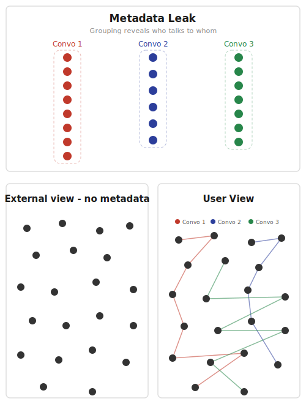

# Chatter

[Chatter](https://vaaxjx64bdwibfoc6nwxkelica3lfppxwilmws4s4bskfknkr7ra.vastrum.net)

The key component to chatter is the "anonymous inbox"

## Anonymous inbox

An anonymous inbox is basically just a shared Sha256 hash between two participants

The first message to such an inbox is to the 
  
    First hash + salt

The second message goes to 
  
    Sha256(first_hash) + salt

The third message 

    Sha256(Sha256(first_hash)) + salt


To sync from an anonymous inbox, you read the keyvalue for each hash, ratcheting forward until you find an empty key.

When you find an empty key you are fully synced.


### Properties of this
- For external observer, there is no way to associate inbox message ids with a specific inbox, they are just random messages
- Because of this you avoid leaking metadata
- The sync speed is constant time in terms of blockchain size, the user does not need to scan the whole blockchain
- This assumes the RPC node the user requests the data from does not store any data
- To make it more robust would have to add private information retrieval keyvalue reads




## How it is used in chatter

The conversation invite link is an anonymous inbox, ie the private key to the inbox is this.

    c77f0807d9fa2069b2223df4752b0f43f6fdad0ecbbcc7623cd9d24bd933c72143b5b622da8849a6f3378cfc9ce6d9c0fef524c261a8113649dc2a38d59f4a56


Any users who want to initiate a conversation with you will have read + write access to that anonymous inbox by entering that private key invite link.

A user will ratchet the inbox until empty spot is found > write their conversation request to that empty id.



### Request properties

- The conversation request is encrypted with the recipients public key
- The conversation request contains a randomly generated shared conversation key
- The shared conversation key will be used to derive two anonymous inbox
- Each participant in the conversation have their own anonymous inbox to avoid overwriting and sync issues

After a conversation request, each participant in the conversation have their anon inboxes and can start sending messages.

  User 1 writes to anon inbox 1, and reads from anon inbox 2. User 2 writes to anon inbox 2 and reads from anon inbox 1


### Usernames

There is also usernames implemented, check [chatter_state.rs (gitter preview)](https://yts27rvo7ppzq5rrjyavmfwecrbyc5ksldmitiggycetgh6zguoa.vastrum.net/repo/vastrum/tree/apps/chatter/frontend/src/chatter/chatter_state.rs) for how it is implemented.


### Syncing local user data between devices

There is also synced cloud data using same model of an anonymous inbox, except recipient is yourself, 
this allows you to store chatter conversation state without linking metadata updating pattern to a persistent identity.


### Group chats

To implement group chats, you would have each participant have their own inbox for sending messages.

There are many ways to handle inviting new participants with various trusts levels and depending on if historical messages should be shown to the new participant.


## Specific implementation details

The contract is basically just a wrapper for a keyvalue store.

```rust
#[contract_state]
struct Contract {
    inbox: KvMap<String, String>,
}

#[contract_methods]
impl Contract {
    pub fn write_to_inbox(&mut self, inbox_id: String, content: String) {
        self.inbox.set(&inbox_id, content);
    }
}
```


To see specific implementation details, check the Chatter Gitter repo, specifically these two files

[anonymous_inbox.rs (Gitter preview)](https://yts27rvo7ppzq5rrjyavmfwecrbyc5ksldmitiggycetgh6zguoa.vastrum.net/repo/vastrum/tree/apps/chatter/frontend/src/chatter/anonymous_inbox.rs)

and

[chatter_state.rs (Gitter preview)](https://yts27rvo7ppzq5rrjyavmfwecrbyc5ksldmitiggycetgh6zguoa.vastrum.net/repo/vastrum/tree/apps/chatter/frontend/src/chatter/chatter_state.rs)

The rest of the chatter frontend is largely vibecoded and not very interesting.

Chatter is the only app that is fully built as a Rust project, it uses [Yew](https://github.com/yewstack/yew)
There is no Javascript used at all, only Rust compiled to WASM.

Chatter follows standard app pattern
- Deploy > Rust crate that handles building frontend and contract and deploying contract + frontend to blockchain
- ABI > Macro generated code for automatically creating bindings between frontend and contract
- Contract > Rust WASM contract backend, contains just a simple keyvalue write function
- Frontend > Yew, fully Rust frontend

### Issue with current chatter implementation

Currently any user can write to any key, this means you could DOS other users by overwriting their inboxes with garbage data.

Instead could treat the shared seed as a private key, then write to the public key of that private key.

The contract would then require all writes to be to an ed25519 public key and require the user to provide a signature for the content.

There is an issue for this on the Gitter repo for Vastrum if you want to try to implement it.

Letterer had similar problem, this was solved by each document key being a public key. You can look at the letterer contract for inspiration.


[Chatter on Gitter](https://yts27rvo7ppzq5rrjyavmfwecrbyc5ksldmitiggycetgh6zguoa.vastrum.net/repo/vastrum/tree/apps/chatter)
