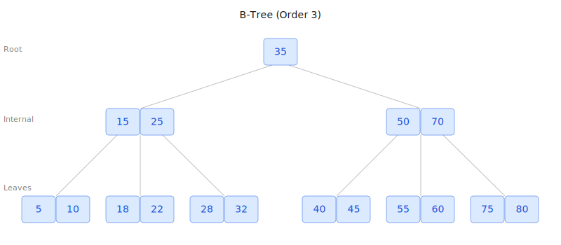
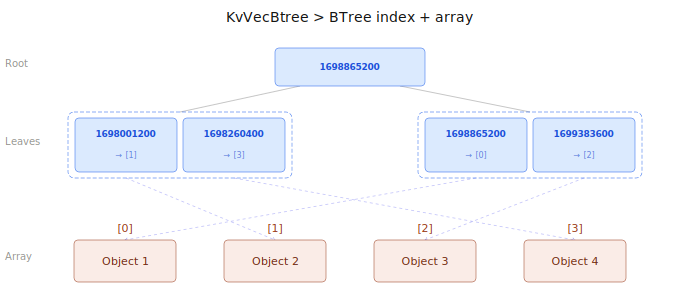

# Concourse

[concourse.vastrum.net](https://concourse.vastrum.net)

Concourse is an experimental decentralized alternative to Discourse.

The most basic feature required by a forum application is to provide pagination of posts + order posts by bump time / last activity time.

Pagination could be solved by pushing all posts to an array and reading the highest index in the array to get the most recent posts.

This allows you to view the posts ordered by creation time, however it does not allow for posts to bumped to the first page when a reply is made.

For this you need some kind of BTree like structure which provides ordered guarantees for the data.

By setting the last active timestamp as the key in the BTree you can efficiently query for the posts with the most recent activity in "log(n)" requests.

Whenever a reply is made to a post, you just update the timestamp for the post in the BTree.



The KvVecBtree is a combination of a KvVec and KvBTree, this allows you to index a post by its timestamp but also by a constant ID.

If you just had a timestamp it would be very complex to update the state of a post.




## How KvVecBtrees are used in concourse

Concourse is composed of different categories, each category has their own KvVecBTree of posts which allow for pagination and viewing posts sorted by bump time.

This data structure allows the client to efficiently query the latest 10 posts by bump time + paginate the requests so can get page 1,2,3,4... and so on using this API.

```rust
pub fn get_descending_entries(&self, count: usize, offset: usize) -> Vec<V> 
```

Every new post is inserted in the posts KvVecBTree with the current block timestamp.

This means when a client does a request such as get_descending_entries() he will get the most recent posts.

Whenever a reply is made to a post, the timestamp for that post is updated using this API.
```rust
pub fn update(&self, id: u64, new_sort_key: S, value: V) 
```


To read more about the KvVecBTree implementation, check [KV Structure docs](../tech/contract-runtime/kv-structure.md).

This is an excerpt from the concourse contract.

```rust
#[contract_type]
struct Post {
    id: u64,
    title: String,
    content: String,
    timestamp: u64,
    last_bump_time: u64,
    replies: KvVecBTree<u64, PostReply>,
    from: Ed25519PublicKey,
}
#[contract_type]
struct PostReply {
    id: u64,
    content: String,
    timestamp: u64,
    from: Ed25519PublicKey,
}

#[contract_type]
struct Category {
    name: String,
    description: String,
    posts: KvVecBTree<u64, Post>,
}

#[contract_state]
struct Contract {
    categories: KvMap<String, Category>,
    category_list: Vec<String>,
    admins: Vec<Ed25519PublicKey>,
}

#[contract_methods]
impl Contract {
    #[authenticated]
    pub fn create_post(&mut self, category_name: String, title: String, content: String) {
        if title.len() > MAX_TITLE_LEN || content.len() > MAX_CONTENT_LEN {
            return;
        }
        let now = runtime::block_time();
        let from = runtime::message_sender();

        let category = self.categories.get(&category_name).unwrap();
        let id = category.posts.next_id();
        let post = Post {
            id,
            title,
            content,
            timestamp: now,
            last_bump_time: now,
            replies: KvVecBTree::default(),
            from,
        };
        category.posts.push(now, post);
    }

    #[authenticated]
    pub fn reply_to_post(&mut self, category_name: String, post_id: u64, content: String) {
        if content.len() > MAX_CONTENT_LEN {
            return;
        }
        let category = self.categories.get(&category_name).unwrap();
        let mut post = category.posts.get(post_id).unwrap();

        let now = runtime::block_time();
        let from = runtime::message_sender();
        let reply_id = post.replies.next_id();
        let reply = PostReply { id: reply_id, content, timestamp: now, from };

        post.last_bump_time = now;

        post.replies.push(now, reply);

        category.posts.update(post_id, now, post);
    }

```


This is how the frontend reads the posts.

```rust
#[wasm_bindgen]
pub async fn get_category_posts(category_name: String, limit: usize, offset: usize) -> Vec<JSPost> {
    let concourse = ContractAbiClient::new(Sha256Digest::from_u64(0));
    let state = concourse.state().await;
    let category = state.categories.get(&category_name).await.unwrap();
    let posts = category.posts.get_descending_entries(limit, offset).await;
    let js_posts = posts.iter().map(convert_post).collect();
    return js_posts;
}
```

[Concourse on Gitter](https://gitter.vastrum.net/repo/vastrum/tree/apps/concourse)