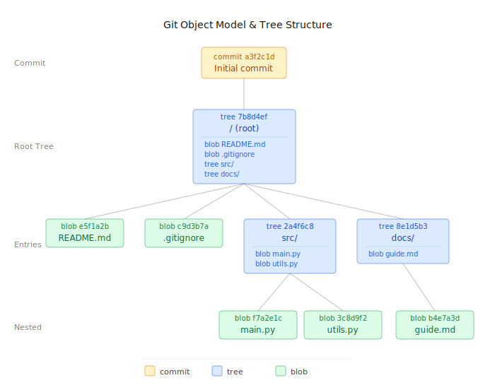

# Gitter

[Gitter example-repo](https://yts27rvo7ppzq5rrjyavmfwecrbyc5ksldmitiggycetgh6zguoa.vastrum.net/repo/example-repo)

Gitter is a prototype for a decentralized Github.

<video width="100%" controls>
  <source src="gitter-demo.mp4" type="video/mp4">
</video>

**Git is based around git objects which can be commits, blobs, trees**

These are the files that are stored inside your .git folder when you use git.



-   Blobs are files - contains the file data (bytes)
-   Tree are directories - contains list of all files and subdirectories within it
-   Commits link to a root tree which represent the root directory

This is what Gitter stores inside the Gitter smart contract.

## Uploading git objects to Vastrum

First the upload_git_object is used to upload git objects.

You send raw git objects to that function, the smart contract calculates the SHA-1 hash of the objects and adds it to the contracts KvMap git_object_store.

By calculating the SHA-1 hash in the smart contract you can just read git objects directly from the contract very easily by using the git object id directly. This would not be possible if you had to trust the hash provided by the uploader for example which could be forged.


Below is an excerpt from the Gitter contract.

```rust
#[contract_state]
struct Contract {
    repo_store: KvMap<String, GitRepository>,
    all_repos: KvVecBTree<u64, GitRepository>,
    forks_store: KvMap<ForksKey, Vec<String>>,
    git_object_store: KvMap<Sha1Hash, Vec<u8>>,
}

#[contract_methods]
impl Contract {
    /// Stores a git object in the contract KV store (commit, blob, tree)
    /// Contract hashes it to verify objectID
    pub fn upload_git_object(&mut self, data: Vec<u8>) {
        let hash = Sha1Hash(Sha1::digest(&data).into());
        self.git_object_store.set(&hash, data);
    }
    #[authenticated]
    pub fn set_head_commit(&mut self, name: String, commit_hash: Sha1Hash) {
        let mut repo = self.repo_store.get(&name).unwrap();

        if repo.owner != message_sender() {
            panic!("not the repo owner");
        }

        repo.head_commit_hash = Some(commit_hash);
        self.repo_store.set(&name, repo);
    }
```


## Updating the head commit of a repository

To update the repository head commit, the owner of the repository just calls this function to change the current head commit of the repo. All of the actual git data is contained inside the commit which is stored inside the contracts KvMap git_object_store.

Because the smartcontract verifies the hash of all git objects this works even though potentially any user could have uploaded the underlying object to the contract.


```rust
#[authenticated]
pub fn set_head_commit(&mut self, name: String, commit_hash: Sha1Hash) {
    let mut repo = self.repo_store.get(&name).unwrap();

    if repo.owner != message_sender() {
        panic!("not the repo owner");
    }

    repo.head_commit_hash = Some(commit_hash);
    self.repo_store.set(&name, repo);
}
```


### Creating a repository

All Gitter repositories are owned by their creator, the creator have full control of setting head_commit and accepting pull requests.

```rust

#[authenticated]
pub fn create_repository(&mut self, name: String, description: String) {
    if name.len() > MAX_NAME_LEN || description.len() > MAX_DESCRIPTION_LEN {
        return;
    }

    let name_already_used = self.repo_store.contains(&name);
    if name_already_used {
        return;
    }

    let repo = GitRepository {
        name: name.clone(),
        description,
        owner: message_sender(),
        head_commit_hash: None,
        issues: KvVecBTree::default(),
        pull_requests: KvVecBTree::default(),
        discussions: KvVecBTree::default(),
    };

    self.repo_store.set(&name, repo.clone());

    let timestamp = block_time();
    self.all_repos.push(timestamp, repo);
}
```

## Forking

Forking is similar, because of the git_object_store forking a new repository just means creating a new repository and pointing head commit at current head commit of the repo being forked. It is a very lightweight operation.

A fork key is used to keep track of your forks in order to display them when creating a pull request in the frontend UI.

```rust
#[authenticated]
pub fn fork_repository(&mut self, new_repo_name: String, repo_to_fork_name: String) {
    if new_repo_name.len() > MAX_NAME_LEN {
        return;
    }
    let name_occupied = self.repo_store.contains(&new_repo_name);
    if name_occupied {
        return;
    }
    let old_repo = self.repo_store.get(&repo_to_fork_name).unwrap();

    let repo = GitRepository {
        name: new_repo_name.clone(),
        description: old_repo.description,
        owner: message_sender(),
        head_commit_hash: old_repo.head_commit_hash,
        issues: KvVecBTree::default(),
        pull_requests: KvVecBTree::default(),
        discussions: KvVecBTree::default(),
    };

    self.repo_store.set(&new_repo_name, repo.clone());

    let timestamp = block_time();
    self.all_repos.push(timestamp, repo);

    let forks_key = ForksKey { repo_name: repo_to_fork_name, from: message_sender() };
    let mut forks = self.forks_store.get(&forks_key).unwrap_or(vec![]);
    forks.push(new_repo_name);
    self.forks_store.set(&forks_key, forks);
}
```


## Creating a pull request


Current method of creating a pull request with actual diffs is
 
1. fork repository 
2. use vastrum-cli vastrum-git-push to update your fork with your local changes
3. create a pull request in original repository with merging_repo = name of your fork repo

So you cannot use branches or other forms of coordinating development, however it is probably possible to add support for such workflows in the future.

```rust
#[authenticated]
pub fn create_pull_request(
    &mut self,
    to_repo: String,
    merging_repo: String,
    title: String,
    description: String,
) {
    if title.len() > MAX_TITLE_LEN || description.len() > MAX_CONTENT_LEN {
        return;
    }
    let repo = self.repo_store.get(&to_repo).unwrap();

    let timestamp = block_time();
    let id = repo.pull_requests.next_id();
    let pull_request = PullRequest {
        id,
        title,
        description,
        merging_repo,
        reply_count: 0,
        replies: KvVecBTree::default(),
        is_open: true,
        is_merged: false,
        from: message_sender(),
        created_at: timestamp,
    };

    repo.pull_requests.push(timestamp, pull_request);
}
```

To see the full contract code + frontend you can check the Gitter repo on Gitter

[Gitter on Gitter](https://yts27rvo7ppzq5rrjyavmfwecrbyc5ksldmitiggycetgh6zguoa.vastrum.net/repo/vastrum/tree/apps/gitter)

[vastrum-monorepo on Gitter](https://yts27rvo7ppzq5rrjyavmfwecrbyc5ksldmitiggycetgh6zguoa.vastrum.net/repo/vastrum)


## Frontend

The Gitter frontend hosted on Vastrum supports the following.

- View all repositories sorted by timestamps
- View repository info + readme
- File explorer
- Pull request creation
- Pull request diff viewer
- Merge pull requests inside the frontend (without having to use a cli)
- View issues, discussions and make posts + reply


The file explorer, the pull request diff viewer and the in browser pull request merging are the most technically interesting features of the frontend.

### File explorer

The in browser file explorer was feasible to implement because of how git is structured.

Git basically has a "tree" object for every directory.

This makes it very easy to query what files exists in the root of the repository + in each nested directory.

These tree objects also contains the git object id for each file that exists in that repository. So you can just read that objectid from the smart contract to preview the contents of that file such as the code.


### Pull request diff viewer

In the frontend you can see the diff of a pull request.

-   The basic operation is to just read the head_commit of the merging repo and the base repo.
-   Then just recursively compare the git trees to find all filenames with different content hash.
-   Then just get the contents of those files, compute the difference in content and display it in the frontend. 


### Pull request merging inside web browser context

To implement pull request merging in the frontend you need to locally simulate the outcome of merging two repos.

This is done by locally performing a 3 way merge and checking the result.

If it is just a fastforward merge, that means the frontend just has to change the head_commit of the current repo to to the head_commit of the pull_request repo.

If it is a 3 way merge where the branches have diverged (but the changes dont touch the same files), the frontend has to
-   Create new tree for every directory which has files changed by both branches
-   Create a new commit which merges the two branches.

Currently only fastforward merges and 3 way merges are supported in the frontend.


#### Merging more difficult pull requests in frontend
-   For merging pull requests where both branches change the same file you would have to upload a new file, this might require a lot of gas but it should not be impossible.

-   For merging pull requests where there are conflicts i think it is okay to require user to resolve the diffs natively instead of inside the frontend.


### Issues, discussions and pull requests

All of these use KvVecBTrees similar to how concourse implemented posts.


### How to use Gitter


**Create a Repository**

1. Go to [gitter.vastrum.net](https://gitter.vastrum.net)
2. Click "New Repository"
3. Set your SSH key in repository settings
4. Push your code using normal Git SSH pushes


You can also use the vastrum-cli to interact with Gitter. The vastrum-cli directly writes to the blockchain and verifies the cloned Git state against the state hash.

***Install vastrum-cli***
```
curl -sSf https://raw.githubusercontent.com/vastrum/vastrum-monorepo/HEAD/tooling/cli/install.sh | sh
```
***Push using vastrum-cli***
```
vastrum-cli vastrum-git-push <REPO_NAME> <PRIVATE_KEY>
```


-   You can get the private_key from the wallet modal, the video at the top of the page shows how to get your private key.


### Remaining features needed

#### Protocol level blockers
-   Need web2 like email account recovery, otherwise very easy to lose access to your repo
-   Need write only writes in order to allow for very cheap git object uploads

#### Interesting to do
-   Encrypted private repos, maybe without leaking metadata also?
-   SHA-1 is not secure, basically fine for now though

[Gitter on Gitter](https://yts27rvo7ppzq5rrjyavmfwecrbyc5ksldmitiggycetgh6zguoa.vastrum.net/repo/vastrum/tree/apps/gitter) | [vastrum-monorepo on Gitter](https://yts27rvo7ppzq5rrjyavmfwecrbyc5ksldmitiggycetgh6zguoa.vastrum.net/repo/vastrum)
